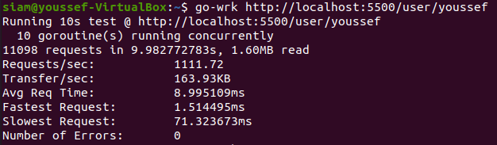

<h1>Go Spell</h1>

A simple <a href="http://twitter.com/">twitter</a> clone implemented using 
* Framework: <a href="https://github.com/gin-gonic/gin" >Gin</a>
* Database: <a href="https://www.mysql.com/" >mysql</a>
* Frontend: <a href="https://reactjs.org/" >React</a>, <a href="https://material-ui.com/" >MaterialUI</a>

<h1>Performance Benchmarking (load test)</h1>


<h2>To setup the project in your machine</h2>

```bash
git clone https://github.com/youssefsiam38/go-spell.git
```
```bash
git clone https://github.com/youssefsiam38/go-spell-client.git
```

 move the `go-spell-client` folder to the root of this folder

```bash
docker-compose up --build
```
```bash
go run main.go
```

Open `http://localhost` in your browser

> here is a <a href="https://www.postman.com/">postman</a> collection JSON <a href="https://www.postman.com/collections/57515ddaceda8c8ecc31" >file</a> If you want to deal with the API

This project implemented using layered structure that discussed by <a href="https://github.com/katzien">Kat Zien</a> in <a href="https://www.youtube.com/watch?v=oL6JBUk6tj0&t=245s">GopherCon 2018</a>

